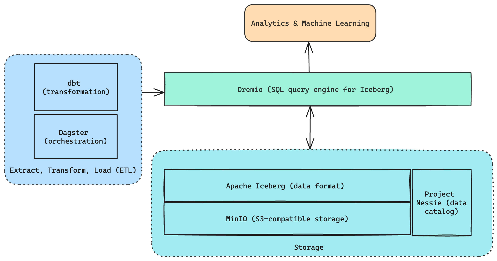
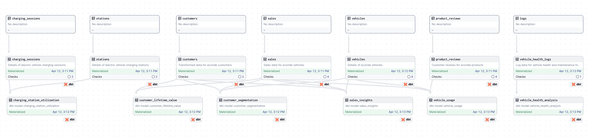

# Lakehouse Data Management Project

## About the Project
This project demonstrates the construction of a data lakehouse focused on a mock company, "FutureMobility EVs". This project showcases a fully operational data lakehouse architecture that can be deployed and run locally on your computer.

**Key Features**:
- **Local deployment**: Designed to run completely within your local environment, this project is ideal for development, testing, and educational purposes. It allows you to explore the functionalities of a complex data lakehouse without the need for cloud services.
- **Open source stack**: Leveraging leading open-source technologies such as MinIO, Apache Iceberg, Dremio, Project Nessie, dbt, and Dagster, the project is not only cost-effective but also highly customizable and transparent.
- **End-to-end solution**: From data ingestion and storage in MinIO, managed in Iceberg format, through complex transformations handled by dbt, to sophisticated querying capabilities provided by Dremio, and orchestrated workflows via Dagster, this architecture covers all aspects of modern data management practices.

## Project Architecture Overview



This project leverages a robust data lakehouse architecture that integrates several cutting-edge technologies to handle the ingestion, storage, management, transformation, and querying of data across multiple layers. Below is an in-depth look at each component and its role in the system:

### MinIO
- **Purpose**: Acts as the foundational storage layer for the entire data lakehouse.
- **Details**: All raw and transformed data is stored in a MinIO S3 bucket named `lakehouse`. MinIO provides S3-compatible storage, making it ideal for scalable and secure data storage that is accessible by various data processing tools.

### Apache Iceberg
- **Purpose**: Manages the data format for storing large-scale datasets in the lakehouse.
- **Details**: Iceberg is used to format the data stored in MinIO, offering advanced data management capabilities such as schema evolution, hidden partitioning, and efficiency in data access. This format is critical for ensuring data consistency and reliability across multiple data processing stages.

### Dremio
- **Purpose**: Serves as the query engine that facilitates flexible and powerful data analysis.
- **Details**: Dremio integrates seamlessly with both MinIO and Nessie, providing the capability to perform SQL queries across different layers of data stored in the Iceberg format. It optimizes query performance and simplifies data governance.

### Project Nessie
- **Purpose**: Acts as the version control system for the data, similar to Git for code.
- **Details**: Nessie helps manage and maintain different versions of the data, allowing for rollbacks, branch creations, and maintaining a history of changes. This integration enables more agile data management and ensures that all transformations are trackable and reversible if necessary.

### Docker Compose
- **Purpose**: Manages the deployment of MinIO, Nessie, and Dremio.
- **Details**: Using Docker Compose simplifies the process of setting up and maintaining the necessary services for the data lakehouse. It ensures that all components are deployed in a consistent, reproducible manner, facilitating easier scaling and management of infrastructure.

### dbt (Data Build Tool)
- **Purpose**: Transforms data stored in the bronze layer into more refined forms in the silver and gold layers.
- **Details**: dbt is used for defining, testing, and documenting data transformations. It brings engineering best practices to the process of preparing data for analytics and business intelligence.

### Dagster
- **Purpose**: Orchestration tool that manages the workflow and dependencies of the entire pipeline.
- **Details**: Dagster schedules and runs tasks necessary to ingest raw data into the bronze layer and transform it through the silver and gold layers using dbt. It ensures that each step is executed in the correct order and only when its dependencies are satisfied, providing robustness and reliability to the data pipeline.

## Repository Structure

This project is organized into several directories, each serving a specific function in the lifecycle of data from ingestion through transformation to orchestration. Below is a breakdown of the main directories and their contents:

- **`/data`**: Contains all the source data files used for initial data ingestion into the bronze layer of the lakehouse.

- **`docker-compose.yml`**: Defines the services and configurations necessary to launch the MinIO, Dremio, and Nessie instances using Docker, setting up the local data lakehouse environment.

- **`/ingestion`**: Holds all PySpark scripts responsible for loading data into the 'bronze' layer of the data lakehouse.
  - **`/bronze`**: Contains specific scripts for each dataset, managing the initial loading and processing of raw data into the bronze storage layer.
  - **`/utils`**: Includes helper scripts and utilities that support data ingestion, such as Spark session creation and configuration loading.

- **`/transformation`**: Stores the dbt projects for managing and executing data transformations for both the silver and gold layers.
  - **`/silver`**: Contains the dbt project setup, including models, tests, and configurations for the silver layer transformations.
  - **`/gold`**: Similar to the silver directory but focused on the gold layer, hosting more advanced analytical transformations.

- **`/orchestration`**: Contains the Dagster project files used to orchestrate the entire data pipeline, ensuring that data flows smoothly between layers and transformations are executed in the correct order.

## Data Model

This project is structured around a medallion data lakehouse architecture that ensures efficient data management, transformation, and analysis. Below is a detailed explanation of each layer and the role it plays in the overall data ecosystem:

### Data Layers
- **Bronze Layer**: Raw data ingestion into the lakehouse using PySpark scripts.
- **Silver Layer**: Intermediate transformations handled by dbt, preparing data for analytics.
- **Gold Layer**: Final transformations producing analytics-ready datasets, materialized using dbt.

#### Source Data
- **Source Files**: The data originates from various structured, semi-structured and structured files (e.g., CSV, JSON, PDF) which are initially loaded into the MinIO S3 bucket under the 'bronze' prefix. You can find these files under the `data` folder in this project.

#### Bronze Layer
- **Raw Data Ingestion**: Data ingestion scripts (written in PySpark) load raw data into the MinIO bucket. This data is stored in Apache Iceberg format to leverage Iceberg's capabilities for handling large-scale datasets efficiently.
- **Purpose**: This layer acts as the immutable source of truth for raw data within the lakehouse.

#### Silver Layer
- **Data Cleaning and Formatting**: Using dbt, transformations are applied to clean and format the raw data. These transformations are designed to prepare the data for more complex analytical queries and machine learning models.
- **dbt Models**: Each dbt model in the silver layer focuses on specific data improvements such as data type corrections and selection of relevant columns.
- **Materialization**: Models in this layer are as tables in Dremio, optimized for quick access and query efficiency.

#### Gold Layer
- **Advanced Transformations**: The gold layer consists of dbt models that perform more complex transformations, aggregations, and joins to support specific analytics needs.
- **Use Cases**: Data in this layer is structured to support specific use cases such as customer behavior analysis, operational efficiency tracking, and predictive maintenance.
- **Materialization**: These models are materialized as views in Dremio.



## Installation

### Prerequisites

Before you get started with this project, make sure you have the following installed:

1. **Java**: The Spark framework requires Java to be installed on your system. Make sure you have at least Java 8 or higher.

2. **Python**: This project is developed using Python. Ensure you have Python 3.9 or newer.

3. **Docker**: Since the project uses Docker for running services like MinIO, Dremio, and Nessie, Docker must be installed. Download Docker from [Docker's official site](https://www.docker.com/get-started).

### Installation Steps
1. **Clone the Repository**:
   ```
   git clone https://github.com/ThaliaBarrera/lakehouse-capstone.git
   ```

2. **Navigate to the Project Directory**:
   ```
   cd lakehouse-capstone
   ```

3. **Build and Run Docker Containers**:
   - Ensure Docker is running on your machine.
   - Execute the following command to build and run the necessary services (MinIO, Dremio and Nessie):
     ```
     docker-compose up -d
     ```
4. **Access MinIO**:
    - Go to http://localhost:9000 in your browser and login to the MinIO UI using the credentials defined in the `docker-compose.yml` file.
    - Create a new access key in the `Acesss Keys` section.
        - Update the `.env.example` file with your `AWS_ACCESS_KEY_ID` and `AWS_SECRET_ACCESS_KEY`.
    - Create a bucket named `lakehouse`

5. **Access Dremio and Connect to MinIO and Nessie**:
    - Go to http://localhost:9047 in your browser and create a new account if you don't have one. Then, log into your account.
    - Click on "Add Source" at the bottom left, and select "Nessie" under "Catalogs".
    - In the "General" tab, fill in the details like "Name", "Endpoint" (`http://nessie:19120/api/v2`) and select "None" as the authetication type.
    - Then, go to the "Storage" tab and fill in the details:
      - The "AWS root path" should point to `lakehouse`.
      - Select AWS Access Key as the auth method and fill in with your "AWS Access Key", "AWS Access Secret".
      - Add 3 new "Connection Properties":
        - `fs.s3a.endpoint`: `minio:9000`
        - `fs.s3a.path.style.access`: `true`
        - `dremio.s3.compat`: `true`
    - Click "Save".

6. **Install Python Dependencies**:
   - It's recommended to create a virtual environment:
     ```
     python -m venv venv
     ```
   - Activate the virtual environment:
     - On Windows: `.\venv\Scripts\activate`
     - On Linux/Mac: `source venv/bin/activate`
     
   - Install required packages:
     ```
     pip install -r requirements.txt
     ```

7. **Setting Up Environment Variables**:
   - Copy the `.env.example` file to create a `.env` file (or just rename it):
     ```
     cp .env.example .env
     ```
   - Make sure all the environment variables are correct.

## Project Usage

### 1. **Data Ingestion**:
   - Run the ingestion scripts to load the files in the `data` folder into the `bronze` layer of the data lakehouse:
     ```
     python -m ingestion.bronze.ecoride_ingest
     python -m ingestion.bronze.chargenet_ingest
     python -m ingestion.bronze.vehicle_health_ingest
     ```
### 2. **Data Transformation**:
  The data transformations are handled by dbt. The dbt projects are in the `transformation` folder. Inside the `transformation` folder you'll find two separate projects: `silver` and `gold`, one for each layer of the lakehouse. Before running the transformations, a couple of assets need to be created in Dremio.

  - Go to the Dremio UI, and click on the Nessie `catalog` in Sources.
  - Create a new folder named `silver` inside the catalog. This will create a namespace with the same name in Nessie. This folder will hold the tables corresponding to the silver layer.
  - In the Spaces section, create a new space named `lakehouse` and inside, create a folder named `gold`. These will hold the views created by dbt.
  - Create 2 new environment variables, `DREMIO_USER` and `DREMIO_PASSWORD` and assign the values of your user and password. These variables are used by the `profiles.yml` files to allow `dbt` to connect to Dremio.
  - In the terminal, move to the `transformation/silver` or `transformation/gold` directory:
    ```
    cd transformation/silver
    ```
  - Verify that dbt can connect to Dremio and everything is set up correctly:
    ```
    dbt debug
    ```
  
#### 2.1 **(Optional) Run dbt models**:
  This step is optional, and you can execute it if you'd like to run some of the models, or some of the layers. If you want to execute the full DAG instead, skip to the next section. 

  - Run the models:
    ```
    dbt run
    ```
  - You can then run the gold models by going to the `gold` directory, and executing `dbt run`.

  The silver models should be materialized as tables inside the `catalog`, and the gold models as views in the `lakehouse/gold` space. You can change this behaviour in the `dbt_project.yml` files.

### 3. **Execute full DAG**:
  The dbt projects are orchestrated by Dagster, and it takes care of the necessary dependencies. If you'd like to execute the whole DAG (silver and gold layers), follow these steps:

  - Go to the orchestration folder:
  ```
  cd orchestration
  ```

  - Set up the following environament variable:
  ```
  export DAGSTER_DBT_PARSE_PROJECT_ON_LOAD=1
  ```

  - Launch Dagster:
  ```
  dagster dev
  ```

  - Open the Dagster UI in your browser by going to http://127.0.0.1:3000/. You should see the full DAG. 
  - Click on `Materialize all`, and your models should start materializing! 

  

## Mock Data Description

This project uses mock data to represent various aspects of the fictional company, and it lives in the `data` folder of this project. Each dataset serves a specific purpose in demonstrating the functionality of the data lakehouse.

### EcoRide Vehicles
- **Dataset**: Vehicle Models and Specifications
- **Data Points**: Vehicle details including model, battery capacity, range, and price.
- **Format**: Structured (CSV)
- **Use**: Understanding vehicle diversity, pricing strategies, and customer preferences.

### EcoRide Sales
- **Dataset**: Vehicle Sales Transactions
- **Data Points**: Sales data capturing transaction details, customer and vehicle IDs, dates, and prices.
- **Format**: Structured (CSV)
- **Use**: Sales trend analysis, revenue forecasting, customer buying behavior.

### EcoRide Customers
- **Dataset**: Customer Profiles
- **Data Points**: Customer information including demographic details, contact info, and purchasing history.
- **Format**: Structured (CSV)
- **Use**: Customer segmentation, personalized marketing, customer relationship management.

### ChargeNet Stations
- **Dataset**: EV Charging Station Data
- **Data Points**: Station IDs, locations, capacity, and type.
- **Format**: Structured (JSON)
- **Use**: Charging infrastructure analysis, station utilization, and maintenance planning.

### ChargeNet Charging Sessions
- **Dataset**: EV Charging Session Logs
- **Data Points**: Session details including IDs, timings, energy consumed, and vehicle information.
- **Format**: Structured (JSON)
- **Use**: Analyzing charging patterns, optimizing energy distribution, usage-based billing.

### Product Reviews
- **Dataset**: Customer Reviews of EcoRide Vehicles
- **Data Points**: Review IDs, vehicle models, customer feedback, ratings, and review texts.
- **Format**: Semi-structured (JSON)
- **Use**: Sentiment analysis, product improvement, customer satisfaction tracking.

### Vehicle Health Data
- **Dataset**: Vehicle Performance and Maintenance Records
- **Data Points**: Vehicle maintenance logs, performance metrics, service flags, and battery health.
- **Format**: Semi-structured (JSON)
- **Use**: Predictive maintenance, performance optimization, vehicle health monitoring.

### PDF Documents

Apart from the structured and semi-structured datasets, this project also incorporates a range of PDF documents. These include:

1. **Technical Specifications Sheets**: Detailed specs for each EcoRide EV model.
2. **Vehicle Comparison Brochure**: Comparative analyses of different EcoRide EV models, highlighting their features and benefits.
3. **Maintenance Tips Sheets**: Guides and tips for maintaining the health and performance of EcoRide EVs.

These PDFs serve as a rich source of information for a Large Language Model (LLM) application, enabling it to provide detailed responses based on extensive product knowledge.

Each dataset is synthetically generated to simulate real-world scenarios, showcasing the capabilities of a data lakehouse in handling diverse data types and formats.

## Data Exploration and Analysis

## Contributing

## License

## Contact
